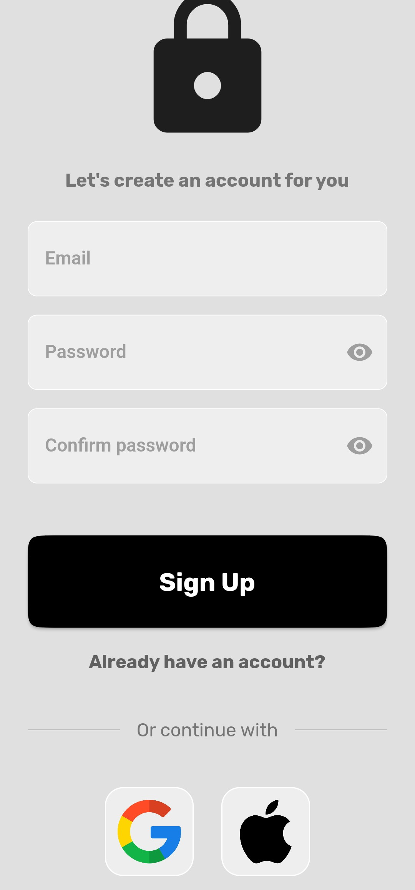

<h2 align="center">Firebase Auth Boilerplate🔒<h2>
<p align="center">
    
</p>

   <h2>Topics 📋</h2>

  <p>
   
   - [About 📖](#about-)
   - [Preview 📱](#preview-)
   - [Learnings 🤯](#---learnings----)
   - [Technologies Used 👨🏽‍💻](#---technologies-used----)
   - [How to Use 🤔](#how-to-use-)
   </p>

   <h2>About 📖</h2>
   
   <p>
    This is a firebase authentication module that I created to speed up my development in future projects that use the same authentication pattern using firebase. With this module you can create a new account, log in, log in with your Google account and Apple account.
   </p>

---

   <h2>Preview 📱</h2><br>

   <p a>
    
    
   </p>

---

 <h2>
   Learnings 🤯
   </h2>
    Strengthened knowledge of Firebase and Firebase authentication.
 
---

 <h2>
   Technologies Used 👨🏽‍💻
   </h2>
   
  * Flutter       
  * Dart      
  * Firebase       
  * Firebase_Authenticator         
  * Google_sign_in      
  
---

   <h2>How to Use 🤔</h2>

```
- Clone this repository:
$ git clone https://github.com/Franciscof11/Firebase_Auth_Boilerplate Firebase_Auth_Boilerplate

- Enter in directory:
$ cd Firebase_Auth_Boilerplate

- For install dependencies:
$ flutter pub get

- Connect your emulator or physical device

- Run the app:
$ flutter run
```

---

This project was developed by **[@Francisco Gabriel](https://www.linkedin.com/in/franciscossg/)**,
if it helped you, give ⭐, it will help me too 😉.

---

   <div>

[](https://www.linkedin.com/in/franciscossg/)

   </div>

